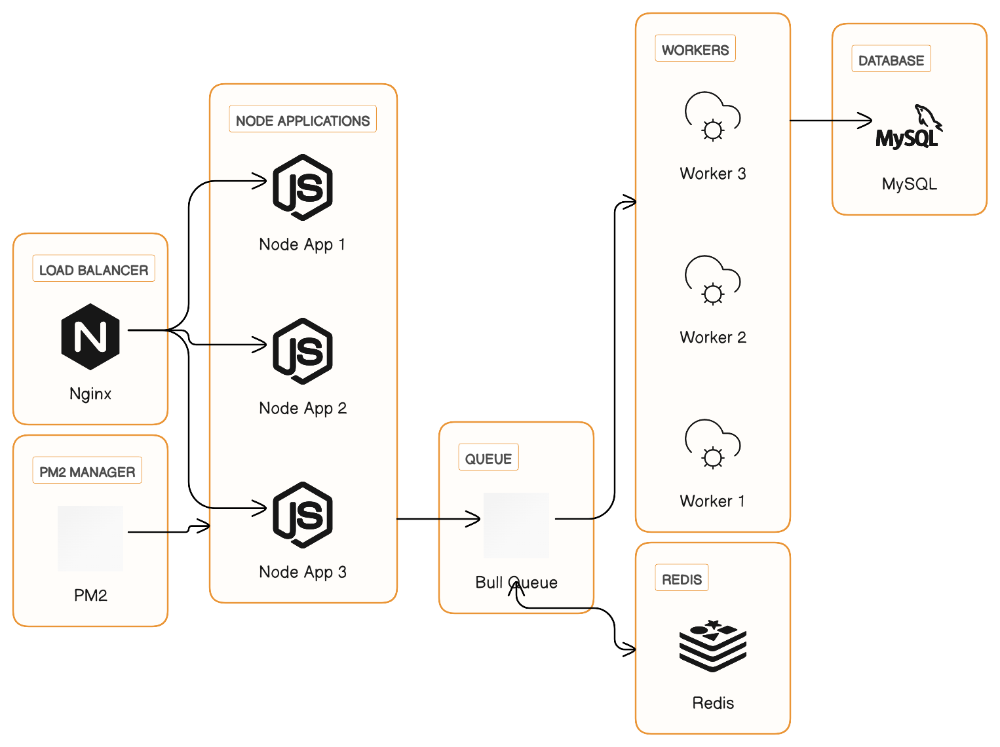

# Project Name

Namastecorp assignment

## Architecture

Here's a high-level diagram of the components in our application:



## Prerequisites

Before you begin, make sure your development environment includes the following:

- Docker
- Docker Compose

## Installation

1. Clone the repository:

```bash
git clone https://github.com/minhhieple97/namastecorp-assignment.git
```

2. Create a `.env` file in the root of the project, following the example in `.env.example`, and fill in the necessary environment variables.

3. Build and start the development containers with Docker Compose (Container may take up to 30 seconds to start up):

```bash
docker-compose up -d api_dev
```

This will build the Docker images and start the containers for the development environment.

4. Access the Nest.js application at `http://localhost:3000`.

## Usage

To use the API, follow these steps:

1. Open your browser or a tool like Postman and make a POST request to `http://localhost:3000/flights` with the `x-api-key` header set to `asjdfh23r9u23r9fj`.
2. In the request body, include a JSON object with an array of flight data:

```json
{
  "flights": [
    {
      "from": "HN",
      "to": "HCM"
    },
    {
      "from": "HCM",
      "to": "SFO"
    },
    {
      "from": "SFO",
      "to": "GRU"
    },
    {
      "from": "GRU",
      "to": "SCL"
    },
    {
      "from": "SCL",
      "to": "LHR"
    },
    {
      "from": "LHR",
      "to": "CDG"
    },
    {
      "from": "CDG",
      "to": "SYD"
    },
    {
      "from": "SYD",
      "to": "JFK"
    }
  ]
}
```

To run the unit tests, run `npm run test` in the terminal. This will run all the unit tests and output the results to the console.

## Migration

Need run all command bellow inside container

1. Generate a migration file for initializing the database schema:

```
npm run migration:generate -- src/db/migrations/<fileName>

```

2. Create a migration file:

```
npm run migration:create -- src/db/migrations/<fileName>

```

3. Run migration file

```
npm run migration:run

```

## Build image

- Build image for specify environment

```
docker-compose build --no-cache --build-arg TARGET=<environment> <image_name>

```

## Running in Production

To run the application in production, you should first build a Docker image:

```
docker-compose -f docker-compose.production.yml build --build-arg TARGET=production api_prod
docker-compose -f docker-compose.production.yml up -d

```
